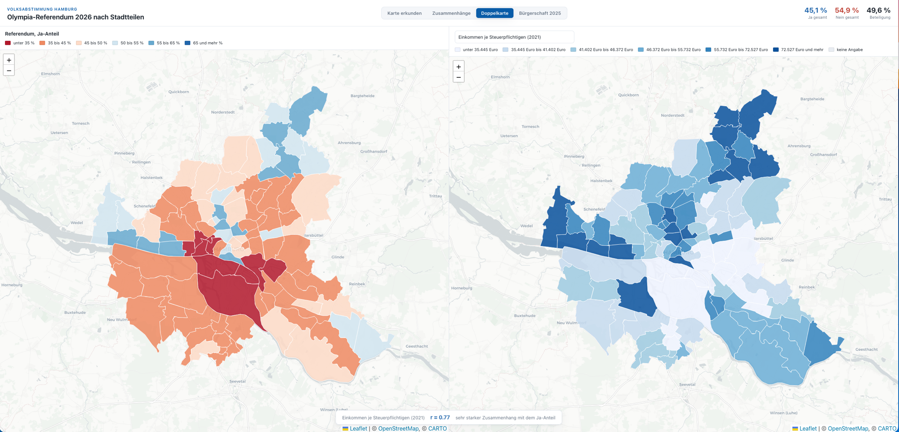

# Olympia-Referendum 2026: Hamburg nach Stadtteilen

Interaktive, reine Frontend-Webkarte plus statistische Analyse: Wie hat jeder
Hamburger Stadtteil beim Olympia-Referendum 2026 abgestimmt (Ja/Nein,
Wahlbeteiligung), wie hängt das mit den sozialstrukturellen Stadtteil-Profilen
2024 zusammen, und wie passt es zur Bürgerschaftswahl 2025?

Die zentrale Frage dahinter: **Welcher Faktor hat statistisch belegbar
darüber entschieden, ob ein Stadtteil eher Ja oder Nein gestimmt hat?**
Die Antwort steht weiter unten im Abschnitt [Kernbefunde](#kernbefunde).



*Doppelkarte-Ansicht: links der Ja-Anteil beim Olympia-Referendum, rechts das Einkommen je Steuerpflichtigen. Beide Karten sind nahezu deckungsgleich, der Zusammenhang liegt bei r = 0,77.*

  

## Schnellstart

```bash
cd app
python3 -m http.server 8765
# Browser: http://localhost:8765
```

Kein Build, kein Login, kein Server. Leaflet mit OpenStreetMap (CARTO Positron),
helles Design, klassierte Choropleth-Karten in der Akzentfarbe von Statistik Nord.

## Die Web-App: vier Ansichten

1. **Karte erkunden.** Klassierte Choropleth-Karte, einfärbbar nach Wahlergebnis
   oder nach 30 Stadtteil-Merkmalen. Info-Karte je Stadtteil, Suche, Streudiagramm
   mit Pearson-Korrelation.
2. **Zusammenhänge.** Eine Wand aus Mini-Karten, sortiert nach Stärke des
   Zusammenhangs. Jede Karte ist nach Ja-Richtung eingefärbt (blau geht mit Ja
   einher, rot mit Nein). Je ähnlicher eine Karte der Referendums-Karte, desto
   stärker der statistische Zusammenhang.
3. **Doppelkarte.** Zwei synchron gezoomte Karten nebeneinander, links das
   Olympia-Ergebnis, rechts ein frei wählbares Merkmal oder ein einzelner
   Parteianteil der Bürgerschaftswahl, dazu Hover-Tooltips und der r-Wert.
4. **Bürgerschaft 2025.** Ergebnis der Bürgerschaftswahl je Stadtteil, wahlweise
   nach stärkster Kraft (Parteifarben) oder nach Stimmenanteil einer einzelnen
   Partei, mit stadtweitem Gesamtergebnis.

## Kernbefunde

Statistische Analyse über die 90 Abstimmungs-Einheiten (`data/analysis_units.csv`,
reproduzierbar mit `scripts/analyze_factors.py`). Stadtweit gab es 65 Einheiten mit
Nein-Mehrheit und 25 mit Ja. Vorab zwei Einschränkungen: Es handelt sich um
Zusammenhänge auf Stadtteil-Ebene, nicht über einzelne Personen (ökologischer
Fehlschluss), und um Korrelationen, nicht um bewiesene Ursachen.

### 1. Der eine Faktor: sozioökonomischer Status

Der dominante Treiber ist der Wohlstand und das Bildungsniveau eines Stadtteils,
am saubersten messbar über das Einkommen je Steuerpflichtigen.

- Einkommen allein erklärt 58 Prozent der Varianz des Ja-Anteils (r = +0,76).
- Im standardisierten Mehrvariablen-Modell behält das Einkommen mit Abstand die
  größte unabhängige Wirkung (Beta = +0,60, t = 7,1, p < 0,0001). Sobald Einkommen
  im Modell steht, verlieren Alter, Migrantenanteil, Bebauung und PKW-Dichte ihre
  Signifikanz.

Der Grund, warum es "der eine" Faktor ist: Einkommen, Arbeitslosigkeit,
Alleinerziehenden-Anteil, SGB-II-Quote und Schulform sind untereinander extrem
hoch korreliert (Beträge von 0,62 bis 0,99; Gymnasial- gegen Stadtteilschulquote
sogar -0,99). Sie messen nicht fünf Dinge, sondern eine latente Wohlstands- und
Bildungsachse. Hamburg hat entlang seines sozialen Gefälles abgestimmt.

### 2. Zwei Stadtteil-Profile

| Merkmal (Durchschnitt) | Ja-Stadtteil | Nein-Stadtteil |
|---|--:|--:|
| Einkommen je Steuerpflichtigen | 90.800 EUR | 42.900 EUR |
| Arbeitslosenquote | 3,8 % | 7,0 % |
| Alleinerziehende (Haushalte mit Kindern) | 18,6 % | 26,6 % |
| SGB-II-Quote | 4,3 % | 11,2 % |
| Migrationshintergrund | 26,9 % | 43,6 % |
| Gymnasialquote (Sek I) | 66 % | 41 % |
| Wohnfläche je Einwohner | 50 m² | 37 m² |
| Anteil 65 und älter | 21,4 % | 16,8 % |
| Wahlbeteiligung (Olympia) | 60,5 % | 47,4 % |

**Der Ja-Stadtteil ("bürgerlicher Elbvorort"):** wohlhabend, älter, bildungsstark,
viel Eigenheim und Wohnfläche. Beispiele: Nienstedten, Blankenese, Othmarschen,
Wellingsbüttel, Harvestehude (plus HafenCity mit dem höchsten Ja-Anteil, 62 %).

**Der Nein-Stadtteil ("junges, prekäres Innenstadt- oder Hafenrand-Quartier"):**
einkommensschwach, migrantisch geprägt, beengtes Wohnen, viel Stadtteilschule.
Beispiele: Veddel/Kleiner Grasbrook/Steinwerder, Wilhelmsburg, Steilshoop,
Billbrook/Rothenburgsort, St. Pauli.

Auffällig ist die Beteiligung: Die wohlhabenden Befürworter-Viertel mobilisierten
13 Prozentpunkte stärker an die Urnen.

### 3. Partei oder Klasse?

Auf den ersten Blick wirkt es parteipolitisch: CDU-Anteil r = +0,79, Die Linke
r = -0,77. Aber SPD (+0,07) und GRÜNE (-0,04) sind praktisch neutral. Das Votum
folgt nicht der Regierungs- oder Oppositionslinie, sondern dem Wohlstandsgefälle,
an das sich die Parteilandschaft nur anlegt.

Das erklärt die scheinbaren Widersprüche wie Bergedorf (CDU stark, Referendum
trotzdem Nein). CDU-Stärke ist nicht gleich CDU-Stärke. Teilt man die 30
CDU-starken Einheiten am Median-Einkommen:

- CDU-stark und wohlhabend (Durchschnitt 108.000 EUR): Ja-Quote 100 Prozent.
- CDU-stark und einkommensschwach (Durchschnitt 50.000 EUR): Ja-Quote nur 27 Prozent.

Kontrolliert man das Einkommen, fällt der CDU-Effekt von r = +0,79 auf +0,57. Der
Linke-Effekt bleibt dagegen nach Einkommenskontrolle bei -0,76 nahezu unverändert,
trägt also eine eigenständige, einkommensunabhängige Nein-Information. Im
inkrementellen Modelltest hebt der Linke-Anteil das R-Quadrat des Sozial-Modells
eigenständig von 0,72 auf 0,87 (Delta-R-Quadrat +0,16), die CDU nur um +0,07.

Bergedorf ist damit kein Sonderfall, sondern der Prototyp des Typs "bürgerlich,
aber nicht wohlhabend": hoher CDU-Schnitt, aber nur rund 47.000 EUR Einkommen und
22 Prozent Ja-Quote. Dasselbe Muster zeigen die Vier- und Marschlande
(Kirchwerder, Ochsenwerder) und der gesamte Bezirk Harburg (keine einzige
Ja-Einheit).

### 4. Die Abweichler

Aus einem Sozial-Modell (R-Quadrat 0,72) lässt sich je Stadtteil ein erwarteter
Ja-Anteil berechnen. Die größten Abweichungen vom eigenen Profil:

- **Überraschungs-Nein:** Sternschanze (-13,9 Punkte unter Erwartung), Veddel,
  Altona-Nord, Altona-Altstadt, Ottensen, St. Pauli. Geschlossen das
  links-grün-alternative Innenstadt-Milieu: oft solide verdienend und
  bildungsstark (das Modell erwartet Ja), stimmt aber kommerz- und
  gentrifizierungskritisch Nein. Der Resttreiber, der das Sozialprofil überlebt,
  ist der Linke-Anteil (Residuum-Korrelation -0,56).
- **Überraschungs-Ja:** Dulsberg, Jenfeld, Neuallermöhe, Billstedt, Schnelsen,
  Osdorf plus HafenCity. Das SPD-geprägte, einkommensschwächere
  Großsiedlungs-Hamburg mit niedrigem Linke-Anteil und einem eher pragmatischen
  Votum.

### 5. Methodik und Grenzen

- Analyse-Einheit sind 90 Abstimmungs-Einheiten. Für zusammengefasste Einheiten
  wurden die Profil- und Parteiwerte bevölkerungsgewichtet aggregiert.
- Korrelationen nach Pearson, Regressionen als OLS (numpy, ohne scipy/sklearn),
  t- und p-Werte manuell aus der Residualvarianz.
- Aggregatdaten erlauben keine Aussage über einzelne Wählerinnen und Wähler.
  Korrelation ist nicht Kausalität.
- Profilmerkmale Stand 2024, Geometrie Stand 2016.

## Datenquellen

| Datensatz | Quelle | Stand |
|---|---|---|
| Abstimmungsergebnisse | Statistikamt Nord, Olympia-Referendum 2026 (CSV, 698 Abstimmbezirke) | 2026 |
| Bürgerschaftswahl | Statistikamt Nord, Bürgerschaftswahl 2025, Landesstimmen (CSV, 1 972 Stimmbezirke) | 2025 |
| Stadtteil-Merkmale | Statistikamt Nord, Hamburger Stadtteil-Profile (PDF, 68 Kennzahlen) | Berichtsjahr 2024 |
| Geometrie | ALKIS Stadtteile Hamburg (Esri Open Data Hub), reprojiziert von 3857 nach 4326 | 2016 |

## Datenpipeline (reproduzierbar)

```bash
python3 scripts/aggregate_referendum.py     # raw/referendum_raw.csv          -> data/referendum_stadtteile.json
python3 scripts/aggregate_buergerschaft.py  # raw/buergerschaft_land_raw.csv  -> data/buergerschaft_stadtteile.json
python3 scripts/reproject_geojson.py        # raw/stadtteile_raw_3857.geojson -> data/stadtteile_4326.geojson
python3 scripts/build_app_data.py           # + data/stadtteilprofile_2024.json -> app/data/
python3 scripts/build_analysis_table.py     # -> data/analysis_units.csv
python3 scripts/analyze_factors.py          # reproduziert die Kernbefunde
```

## Multi-Agent-Extraktion der Stadtteil-Profile

`data/stadtteilprofile_2024.json` wurde nicht von Hand erfasst, sondern per
Multi-Agent-Workflow aus dem 204-seitigen Statistik-Nord-PDF extrahiert
(`workflows/extract-stadtteilprofile.js`): pro Stadtteil zwei unabhängige
Lesungen, danach ein zellweiser Abgleich und eine Arbiter-Schleife, bis zwei
Lesungen je Zelle übereinstimmen. Ergebnis: 99 Stadtteile mal 68 Kennzahlen, null
ungelöste Zellen. Das QA-Protokoll je Zelle steht unter dem Schlüssel `qa` in der
JSON.

## Projektstruktur

```
app/        index.html, style.css, app.js, data/{stadtteile.geojson, metadata.json}
scripts/    aggregate_*.py, reproject_geojson.py, build_app_data.py,
            build_analysis_table.py, analyze_factors.py
workflows/  extract-stadtteilprofile.js   (Multi-Agent-PDF-Extraktion)
data/       Zwischenergebnisse inkl. stadtteilprofile_2024.json (mit QA) und analysis_units.csv
raw/        Quelldaten (CSV, PDF, Roh-GeoJSON, Feldbezeichner)
```

## Granularität

Geometrie und Merkmale liegen auf 99 Stadtteilen vor, das Wahlergebnis auf 90
Abstimmungs-Einheiten. Acht Einheiten fassen mehrere kleine Stadtteile zusammen,
etwa "Veddel/Kleiner Grasbrook/Steinwerder". Diese teilen sich das Wahlergebnis;
das Feld `referendum_unit` dokumentiert das.
